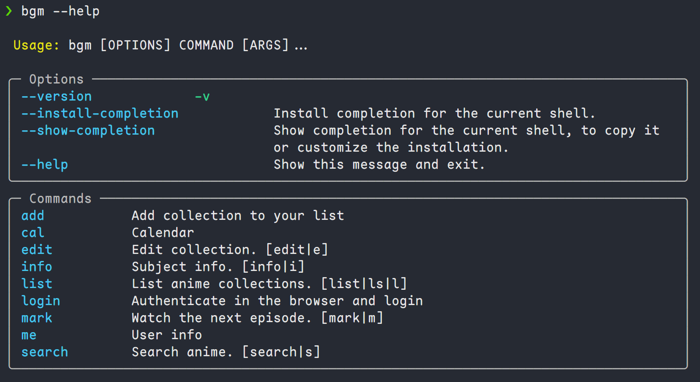

# Bangumi.tv CLI

CLI for https://bgm.tv

Features:

- Add collection
- List and edit collections
- Show calendar
- Search
- Login

## Usage

Login: `bgm login`

Authorize the app in the browser and paste the code to the terminal.

Auth code will be saved in `~/.config/bangumi/auth.yaml`

### Examples

`bgm --help`

`bgm cal`

`bgm ls`

## Development

Bangumi API: https://bangumi.github.io/api

Input your own client id and app secret in `settings.py`

### Requirements

- python 3.11
- poetry for packaging and dependency management
- typer for CLI library

### Installation

Install dependencies: `poetry install`
Build: `poetry build`
Install wheel: `pip install dist/{name}.whl`

### Code Structure

- `api.py` available APIs and actual request implementation
- `auth.py` authorize and store tokens
- `cli.py` the CLI implementation
- `client.py` API request client. A wrapper on `api.py`
- `collection.py` helper functions handling bgm.tv collections
- `settings.py` app secret etc.
- `types.py` data types

### TODO

- [ ] Combine edit and add collection
